# Ahorradas

## Administrador de gastos

En este proyecto [Ahorradas](https://meliegalaz.github.io/trabajoAhorradas/) el usuario puede ingresar sus gastos o ganancias y la aplicación guarda esos datos para después organizarlos y darle datos certeros de sus movimientos

Esta aplicación posee para mayor comodidad modo oscuro y modo claro el cual se cambia con un botón en forma de luna o sol respectivamente

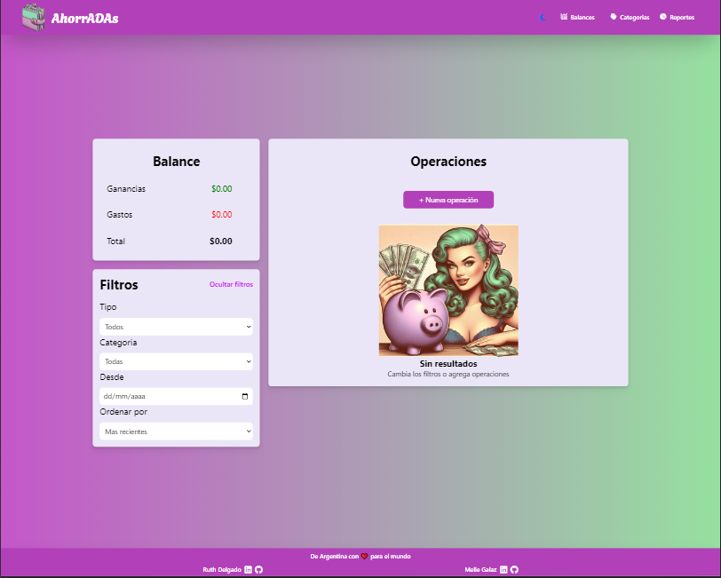
Modo Claro
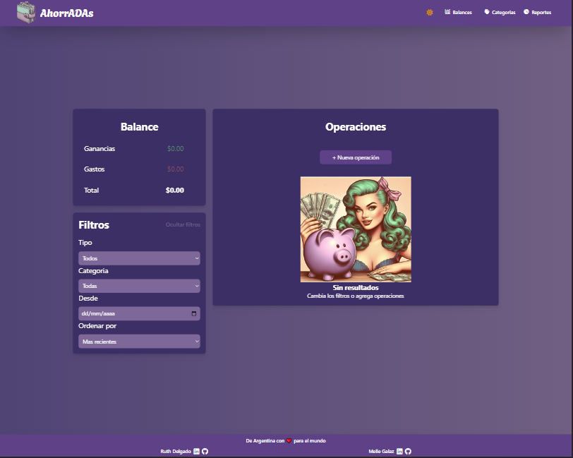
Modo Oscuro

## Balance

### Agregar Operación

La aplicación posee un botón "Agregar operación" el cual abre un un panel para llenar con los datos del nuevo movimiento.Este se carga y se coloca en operaciones, esto se puede realizar todas las veces que el usuario desee.

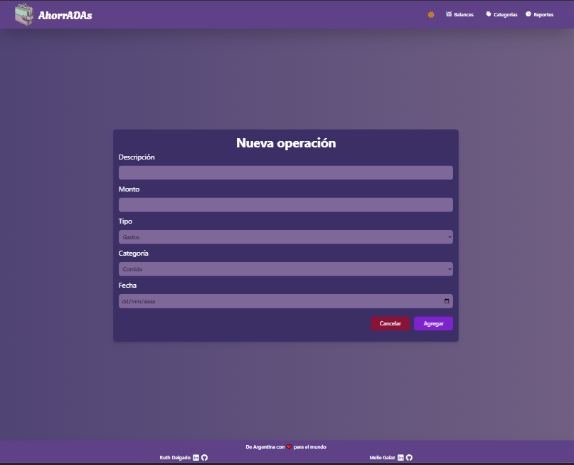
Panel de nueva operación

- Vista de Operaciones con un item cargado

  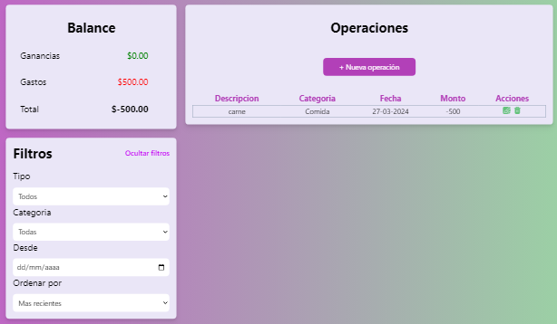

  Al completar Nueva Operación se carga en Operaciones cada dato y se suman dos botones uno de eliminar y otro de editar

* Editar

  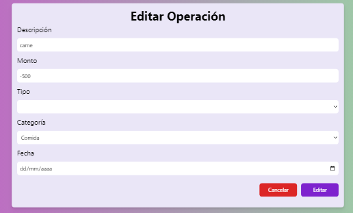

  Aquí se ve que todos los datos que tenemos en el item estan cargados y pueden ser cambiados por el usuario segun sus preferencias.Tiene dos botones uno para cancelar esta edición y otro para guardar los cambios que se realicen.

* Eliminar

  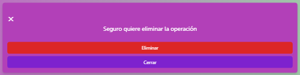

  Al tocar el boton en forma de tacho de basura saldrá esta confimacíon para que el usuario este seguro si quiere eliminar la operación

### Filtros

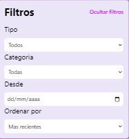

El usuario si a cargado varias operaciones y desea ver en especifico algunas la aplicación posee filtros para ver operaciones segun

- Tipo
  - Gastos o Ganacias
- Categorias

  - Comida
  - Servicio
  - Salida
  - Educación
  - Transporte
  - Trabajo

- Fecha
- Ordenar por

  - Fecha mas reciente
  - Fecha menos reciente
  - Mayor monto
  - Menor Monto
  - Orden A/Z
  - Orden Z/A

### Balance

La aplicación al cargar los gastos y ganacias va haciendo la cuenta y total de cada item y los coloca en el panel dando tambien el total.

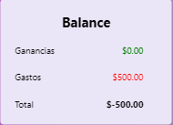

## Categoria

En esta sección se ve el panel donde esta todas las categorias que tiene la aplicación por defecto.El panel tiene un botón por si el usuario desea agregar nombres de categorias según sus actividades diarias.

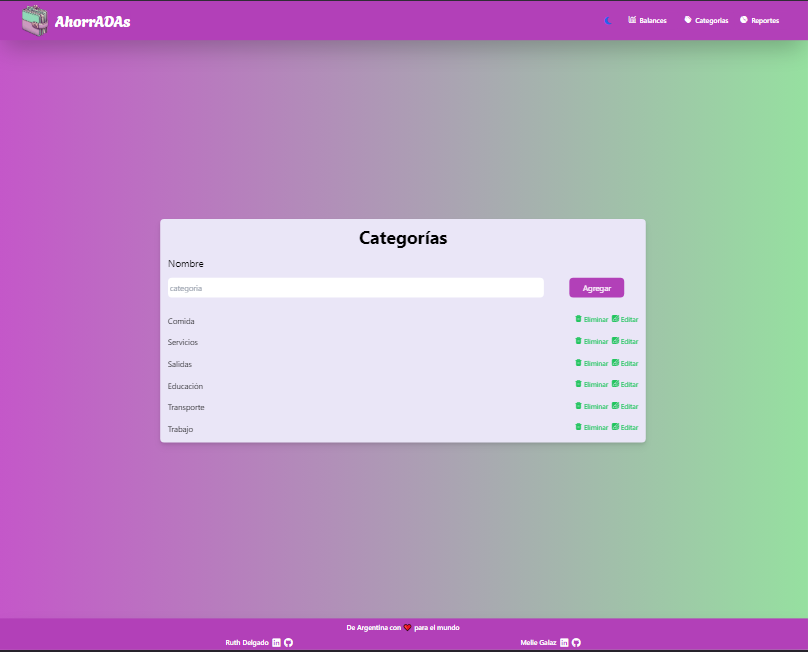

Las categorias pueden ser eliminadas al tocar el boton eliminar.
Saldrá el siguiente aviso para que el usuario este seguro que desea eliminar esa categoria.

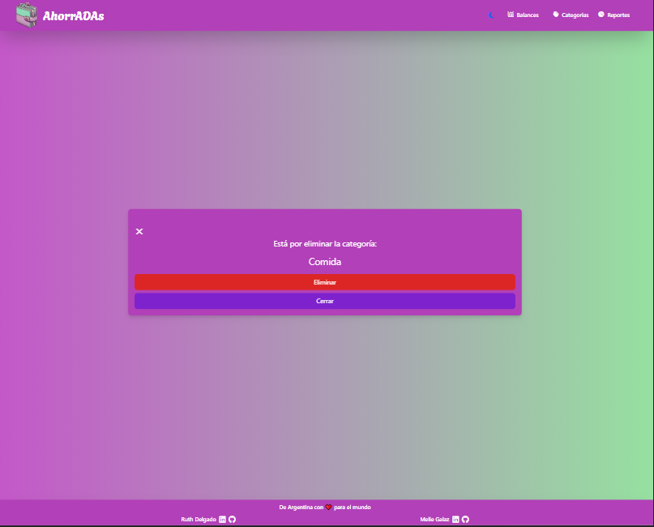

También se puede editar el nombre de la categoria y saldrá el siguiente panel.

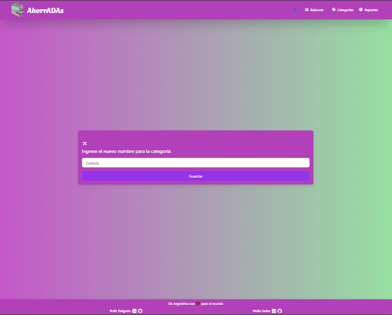

## Reportes

Reportes sin que se cargue operación aún.

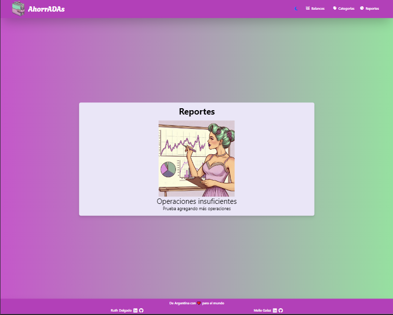

Una vez que se carga una operación se muestran de la siguiente forma:

- Resumen

  - Categoría con mayor ganancia
  - Categoria con mayor gasto
  - Categoria con mayor balance
  - Mes con mayor ganancia
  - Mes con mayor gasto

- Totales por categoria
- Totales por mes

Tabla de reportes ya con una operación cargada

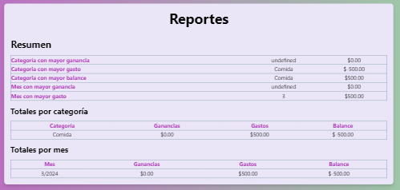

## Construido

Las tecnologías que utilize para construir este proyecto:

- Maquetado HTML
- Estilos Tailwind Css
- Funcionalidad JAVASCRIPT

## Autoras

- ** MELIE GALAZ **
- ** RUTH DELGADO **

## Link para usar la app

https://meliegalaz.github.io/trabajoAhorradas/
# ahorrADAs
# ahorrADAs
